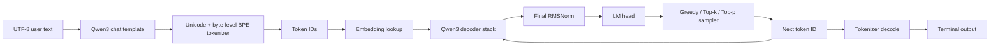
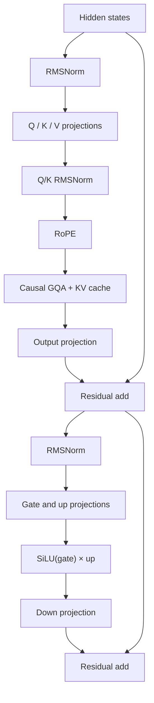

# Qwen3 Runtime

> A correctness-first **Qwen3 Dense inference runtime built from scratch in C++17 and CUDA**.


**No PyTorch runtime. No Transformers runtime. No hidden tensor magic.**

Qwen3 Runtime is an educational inference engine for developers who want to see
what really happens underneath a high-level deep-learning framework: tensor
storage, SafeTensors loading, CUDA kernels, attention, KV caching, tokenization,
sampling, and the complete autoregressive chat loop.

It is small enough to trace from user text to the next token, while complete
enough to run real, architecture-compatible Qwen3 Dense checkpoints.

> [!IMPORTANT]
> This is an independent learning project, not an official Qwen project and not
> a production inference engine.

## Quick Start

### 1. Requirements

- Linux
- An NVIDIA GPU with BF16 support and enough VRAM for the selected model
- NVIDIA driver and CUDA Toolkit
- CMake 3.24 or newer
- A C++17 compiler
- ICU development libraries (`uc` and `i18n`)
- Ninja (recommended)

For example, install the common Linux build dependencies with:

```bash
sudo apt-get update
sudo apt-get install -y build-essential ninja-build libicu-dev
```

Install a recent CMake and the CUDA Toolkit separately if the versions supplied
by your distribution are too old. The project has been developed with CUDA
12.x, GCC 11, CMake 3.30, and NVIDIA L4 GPUs; other compatible toolchains and
NVIDIA GPUs may also work.

### 2. Download a Qwen3 Dense checkpoint

Model files are intentionally not included in this repository. One convenient
way to download the official
[Qwen3-0.6B checkpoint](https://huggingface.co/Qwen/Qwen3-0.6B) is the
[Hugging Face `hf` CLI](https://huggingface.co/docs/huggingface_hub/en/guides/cli):

```bash
python -m pip install -U huggingface_hub

hf download Qwen/Qwen3-0.6B \
  --local-dir models/Qwen3-0.6B
```

Python is used only by this optional download helper. The runtime itself does
not depend on Python, PyTorch, or Transformers.

A model directory must contain:

```text
models/Qwen3-0.6B/
├── config.json
├── tokenizer.json
└── model.safetensors
```

Sharded checkpoints are also supported:

```text
models/Qwen3-8B/
├── config.json
├── tokenizer.json
├── model.safetensors.index.json
├── model-00001-of-00005.safetensors
└── ...
```

### 3. Build

From the repository root:

```bash
cmake -S . -B build -G Ninja \
  -DCMAKE_BUILD_TYPE=Release \
  -DCMAKE_CUDA_ARCHITECTURES=native

cmake --build build --parallel
```

If your CMake/CUDA setup does not accept `native`, provide the compute
capability explicitly. For example, this project defaults to architecture `89`
for NVIDIA Ada/L4:

```bash
cmake -S . -B build -G Ninja \
  -DCMAKE_BUILD_TYPE=Release \
  -DCMAKE_CUDA_ARCHITECTURES=89
```

### 4. Start the terminal chat app

```bash
CUDA_VISIBLE_DEVICES=0 \
./build/qwen3_chat \
  --model models/Qwen3-0.6B \
  --gpu 0 \
  --max-context 4096 \
  --max-new-tokens 512 \
  --sample \
  --temperature 0.6 \
  --top-k 20 \
  --top-p 0.95 \
  --thinking
```

`CUDA_VISIBLE_DEVICES` selects the physical GPUs exposed to the process, while
`--gpu` selects a logical GPU from that visible set. For example, after
`CUDA_VISIBLE_DEVICES=6`, physical GPU 6 becomes logical GPU 0, so pass
`--gpu 0`.

Inspect every command-line option with:

```bash
./build/qwen3_chat --help
```

Useful interactive commands:

| Command | Action |
|---|---|
| `/clear` | Clear the conversation history |
| `/think on` | Enable Qwen3 thinking mode |
| `/think off` | Disable thinking mode |
| `/help` | Show interactive help |
| `/exit` or `/quit` | Exit the application |

## Why This Project Exists

High-level frameworks are excellent for productivity, but they deliberately
hide many details that AI infrastructure engineers need to understand.

This project rebuilds the Qwen3 Dense inference path piece by piece:

- how tensor memory is represented on CPU and GPU;
- how shape, stride, dtype, device, ownership, and views interact;
- how large SafeTensors checkpoints are mapped, validated, and transferred;
- how CUDA kernels implement embedding, normalization, RoPE, attention, and
  elementwise operations;
- how cuBLAS performs the model's linear projections;
- how decoder layers, residual paths, KV cache, the LM head, and sampling
  become an autoregressive generator;
- how Unicode text, byte-level BPE, special tokens, and a chat template become
  model input.

The goal is not to replace mature production engines. The goal is to make the
entire inference path **visible, readable, testable, and modifiable**.

## End-to-End Inference Path



Inside each decoder layer:



## What V1 Implements

### Runtime foundation

- RAII-managed CPU and CUDA memory
- `Device`, `DType`, `Shape`, `Buffer`, `Tensor`, and `TensorView`
- explicit ownership, tensor views, and CPU/GPU transfers
- BF16 inference tensors with FP32 computation where required

### Checkpoint and weight loading

- POSIX memory-mapped files
- SafeTensors metadata parsing and bounds validation
- single-file and sharded SafeTensors checkpoints
- configuration-driven Qwen3 Dense weight validation
- shard-aware loading with pinned host buffers and asynchronous H2D copies
- tied and untied output embeddings

### CUDA and cuBLAS operators

- embedding lookup
- RMSNorm, including Q/K normalization
- residual addition
- SiLU/SwiGLU elementwise activation
- cuBLAS-backed linear layers
- rotary position embedding (RoPE)
- causal grouped-query attention (GQA)
- greedy argmax

### Qwen3 model and generation

- pre-norm decoder layers with two residual paths
- per-layer KV cache
- SwiGLU MLP
- full decoder stack
- final RMSNorm and LM head
- prompt prefill and token-by-token cached decode
- greedy decoding
- temperature, Top-k, and Top-p sampling
- deterministic random seeding
- thinking and non-thinking chat prompts

### Tokenization and chat

- tokenizer loading from `tokenizer.json`
- Unicode validation and NFC normalization through ICU
- regex pre-tokenization
- byte-level BPE encoding
- added-token and special-token handling
- UTF-8 decoding
- Qwen3 chat-template construction
- multi-turn terminal chat

### Verification

- focused CPU and CUDA unit tests
- operator and KV-cache tests
- tokenizer round-trip tests
- checkpoint and weight-loader tests
- real-checkpoint integration and smoke-test executables

## Model Compatibility

The runtime is configuration-driven and designed for
**architecture-compatible BF16 Qwen3 Dense checkpoints**, including the
official Dense sizes:

- Qwen3-0.6B
- Qwen3-1.7B
- Qwen3-4B
- Qwen3-8B
- Qwen3-14B
- Qwen3-32B

Changing model size should require changing the checkpoint directory, not
rewriting the inference graph. The maximum usable size and context length still
depend on available GPU memory.

Current checkpoint requirements:

- `model_type` is `qwen3`;
- architecture is `Qwen3ForCausalLM`;
- weights use BF16 SafeTensors;
- feed-forward activation is SiLU/SwiGLU;
- attention bias, sliding-window attention, RoPE scaling, and quantization are
  not enabled.

Qwen3 Mixture-of-Experts models, such as Qwen3-30B-A3B, are **not** supported
by this Dense runtime.

## Repository Tour

```text
apps/                  Terminal chat application
include/qwen3/         Public runtime headers
src/core/              Device, dtype, shape, buffer, tensor, and views
src/io/                mmap and SafeTensors checkpoint loading
src/cuda/              CUDA/cuBLAS checks and resource wrappers
src/ops/               CUDA and cuBLAS operators
src/model/             Weights, KV cache, attention, MLP, and decoder
src/generation/        Autoregressive generation and sampling
src/tokenizer/         Unicode processing and byte-level BPE
src/chat/              Qwen3 chat-template construction
tests/unit/            Focused component tests
tests/integration/     Pipeline and real-checkpoint smoke tests
tests/toolchain/       CUDA toolchain smoke test
third_party/           Vendored header-only dependencies
models/                Local checkpoints; excluded from Git
```

## Suggested Learning Path

If you are using this repository to learn AI infrastructure, read and run it in
this order:

1. **`core`** — storage, ownership, shape, stride, dtype, device, and views.
2. **`io`** — follow a tensor from a SafeTensors file into GPU memory.
3. **`ops`** — study and test one CUDA/cuBLAS operator at a time.
4. **`model/config` and `model/weights`** — connect checkpoint metadata to
   runtime tensors.
5. **`model/kv_cache`** — understand incremental autoregressive decoding.
6. **`model/self_attention` and `model/mlp`** — assemble operators into
   Transformer sublayers.
7. **`model/decoder_layer` and `model/model`** — follow the complete backbone.
8. **`generation`** — turn logits into a repeated next-token loop.
9. **`tokenizer` and `chat`** — connect human-readable text to model input.
10. **`apps/qwen3_chat.cpp`** — inspect the complete application lifecycle.

The tests are part of the tutorial: each one states a small contract and shows
how the corresponding component is expected to behave.

## Tests

Build the project first, then run the registered test suite:

```bash
CUDA_VISIBLE_DEVICES=0 \
ctest --test-dir build --output-on-failure
```

Tests are intentionally committed to the repository. They document tensor
layout, checkpoint validation, kernel behavior, KV-cache correctness, sampling,
tokenizer round trips, and model-pipeline contracts.

Real-checkpoint smoke executables require an explicit model directory and are
therefore not all registered in CTest. For example:

```bash
CUDA_VISIBLE_DEVICES=0 \
./build/generator_real_smoke models/Qwen3-0.6B
```

## V1 Scope and Limitations

V1 is a correctness-first educational baseline. It implements the complete
inference framework, but it is not aggressively optimized and does not attempt
to compete with production runtimes.

Current limitations include:

- NVIDIA CUDA and Linux/POSIX only;
- BF16 checkpoints only;
- generation batch size of one;
- single-GPU inference;
- no training or fine-tuning;
- no quantization or MoE;
- no tensor or pipeline parallelism;
- no continuous batching, paged KV cache, or production scheduler;
- no FlashAttention;
- sampled decoding currently includes CPU-side work;
- each chat turn re-encodes the complete history and rebuilds its KV cache;
- kernels favor readability and validation over aggressive fusion.

For production workloads, use a mature engine such as vLLM, TensorRT-LLM,
SGLang, or llama.cpp.

## Project Roadmap

### V1 — Build the complete runtime

The current version focuses on exposing every major inference component and
running real Qwen3 Dense checkpoints end to end. Correctness and educational
clarity are the baseline.

### V2 — Optimize the runtime

V2 is planned as an author-led optimization pass. Candidate work includes:

- profiling-driven latency and throughput improvements;
- fused QKV and gate/up projections;
- fused residual and normalization paths;
- faster attention kernels;
- GPU-resident sampling;
- reusable workspaces and fewer temporary allocations;
- improved and reusable KV-cache layouts;
- quantized weight formats;
- more systematic benchmarks across Qwen3 Dense sizes.

Every optimization should retain the V1 correctness tests as its reference.

### V3 — Learn and optimize together

If you have a better CUDA kernel, memory layout, checkpoint loader, scheduler,
or benchmark methodology, discussions and pull requests are welcome. Strong
community improvements may become the foundation of a future V3.

## Contributing

Contributions are welcome, especially when they improve clarity, correctness,
portability, or measurable performance.

For optimization pull requests, please include:

- GPU model;
- CUDA, CMake, and compiler versions;
- model size and context length;
- exact build and benchmark commands;
- latency or throughput before and after;
- correctness results against the existing implementation.

Please preserve the educational nature of the project. A good optimization
should explain not only that it is faster, but also **why**.

## Acknowledgements

This project was created while studying and comparing:

- [QwenLM/Qwen3](https://github.com/QwenLM/Qwen3)
- [asdf93074/qwen.c](https://github.com/asdf93074/qwen.c)
- [lijian736/qwen3.c](https://github.com/lijian736/qwen3.c)

It also relies on or learns from NVIDIA CUDA/cuBLAS, ICU, SafeTensors, and
nlohmann/json.

## Disclaimer

This repository is an educational and experimental implementation. It is not
affiliated with the Qwen team and is not intended for safety-critical or
production deployment.

Model files are distributed separately and remain subject to their original
licenses and terms. Always review the license of the checkpoint you download.
